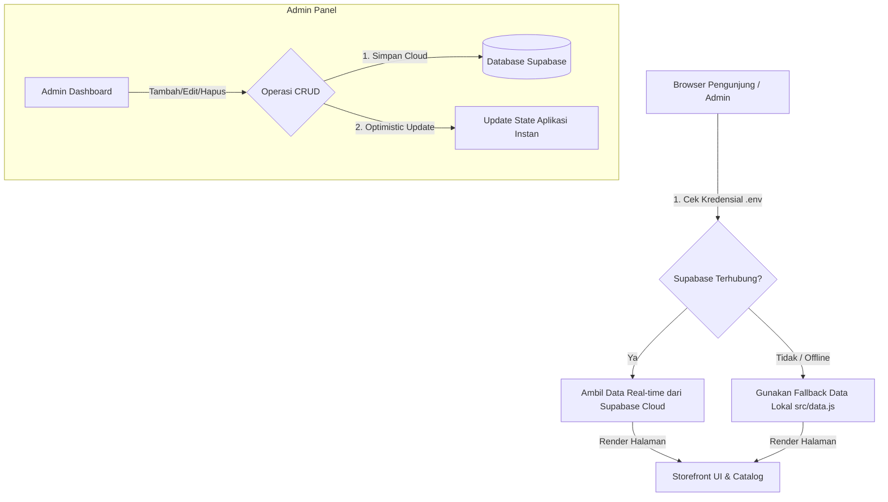

# 🏛️ Arsitektur Integrasi Supabase Cloud Database — Florisse.id

Dokumen ini mendokumentasikan arsitektur transisi sistem Florisse.id dari penyimpanan browser lokal (**localStorage**) ke database cloud terpusat yang sinkron secara real-time (**Supabase**) dengan hosting **Cloudflare Pages**.

---

## 📊 1. Diagram Alur Sistem (System Architecture)

Sistem menggunakan pendekatan **Hybrid-State** yang menjamin website tetap 100% aktif dan interaktif meskipun koneksi internet ke database sedang terganggu (offline-first fallback).



---

## 🗄️ 2. Skema Tabel Database (SQL Schema)

Berikut adalah struktur tabel yang diimplementasikan pada database PostgreSQL Supabase:

### A. Tabel Kategori (`categories`)
Menyimpan daftar kategori dinamis yang digunakan sebagai filter produk.
```sql
CREATE TABLE categories (
  id BIGINT GENERATED BY DEFAULT AS IDENTITY PRIMARY KEY,
  name TEXT UNIQUE NOT NULL,
  created_at TIMESTAMPTZ DEFAULT NOW()
);
```

### B. Tabel Produk (`products`)
Menyimpan katalog produk lengkap beserta variasi, spesifikasi, dan kelengkapan.
```sql
CREATE TABLE products (
  id BIGINT GENERATED BY DEFAULT AS IDENTITY PRIMARY KEY,
  name TEXT NOT NULL,
  category TEXT NOT NULL,
  price TEXT NOT NULL,
  image TEXT NOT NULL,
  variants JSONB DEFAULT '[]',
  best_seller BOOLEAN DEFAULT FALSE,
  "desc" TEXT NOT NULL,
  specs JSONB DEFAULT '[]',
  bonus JSONB DEFAULT '[]',
  material JSONB DEFAULT '[]',
  kuker_options JSONB DEFAULT '[]',
  created_at TIMESTAMPTZ DEFAULT NOW()
);
```

### C. Tabel Kolaborasi (`collaborations`)
Menyimpan kelas, event, dan workshop kolaborasi beserta dokumentasi foto/video.
```sql
CREATE TABLE collaborations (
  id BIGINT GENERATED BY DEFAULT AS IDENTITY PRIMARY KEY,
  name TEXT NOT NULL,
  type TEXT NOT NULL,
  is_coming_soon BOOLEAN DEFAULT FALSE,
  partner JSONB DEFAULT '[]',
  date TEXT NOT NULL,
  location TEXT NOT NULL,
  full_desc TEXT NOT NULL,
  image TEXT NOT NULL,
  video_cover TEXT,
  video TEXT,
  gallery JSONB DEFAULT '[]',
  created_at TIMESTAMPTZ DEFAULT NOW()
);
```

---

## 🔒 3. Kebijakan Keamanan (Row Level Security - RLS)

Untuk memastikan database aman namun tetap mudah diakses dari frontend tanpa backend perantara (serverless), kita menerapkan kebijakan RLS berikut:

* **SELECT (Read)**: Diizinkan untuk publik agar semua pengunjung web dapat melihat katalog produk dan kelas kolaborasi.
* **INSERT/UPDATE/DELETE**: Dilindungi oleh otorisasi (dapat ditingkatkan menggunakan Supabase Auth jika ingin membatasi penulisan hanya untuk admin resmi, saat ini menggunakan otorisasi client-side di rute `#admin`).

```sql
ALTER TABLE categories ENABLE ROW LEVEL SECURITY;
ALTER TABLE products ENABLE ROW LEVEL SECURITY;
ALTER TABLE collaborations ENABLE ROW LEVEL SECURITY;

-- Contoh Kebijakan (Policy) Select Publik:
CREATE POLICY "Allow public read" ON products FOR SELECT USING (true);
```

---

## ☁️ 4. Konfigurasi Lingkungan (Environment Variables)

Variabel lingkungan didefinisikan menggunakan prefiks `VITE_` agar dapat dibaca oleh bundler Vite di frontend.

### Pengaturan Lokal (`.env`)
```env
VITE_SUPABASE_URL=https://ujqmfyshdvqpszyzrlcl.supabase.co
VITE_SUPABASE_ANON_KEY=eyJhbGciOiJIUzI1NiIsInR5cCI6IkpXVCJ9... (Anon Key Panjang Anda)
```

### Pengaturan Cloudflare Pages (Production)
Daftarkan variabel di atas pada dashboard Cloudflare:
1. Masuk ke **Cloudflare Dashboard** -> **Workers & Pages** -> **florisse.id**.
2. Pilih tab **Settings** -> **Environment variables**.
3. Tambahkan `VITE_SUPABASE_URL`` dan `VITE_SUPABASE_ANON_KEY` sesuai nilai di atas.
4. Simpan dan lakukan **Redeploy**.

---

## 💎 5. Keuntungan Arsitektur Ini

1. **Sinkronisasi Real-time**: Perubahan data dari laptop A akan langsung terlihat di HP B tanpa perlu export/import file.
2. **Offline-First Fallback**: Jika kuota Supabase habis atau server mengalami gangguan, website akan otomatis membaca data dari `src/data.js` tanpa merusak tampilan UI.
3. **Keamanan Maksimal**: File `.env` telah didaftarkan pada `.gitignore` untuk mencegah kebocoran kredensial ke repositori publik GitHub.
